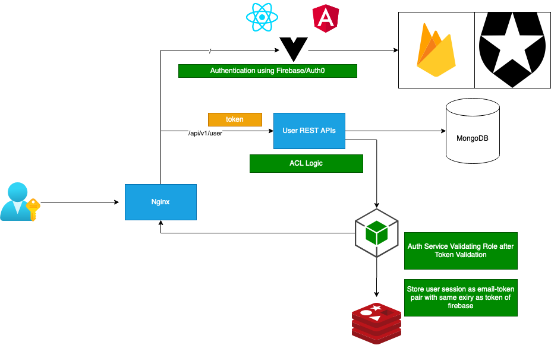

## API services

- Microservices 
- User Service (REST APIs)
- Gatekeeper Service (Validate Token and Roles)
- Proxy Gateway (nginx Routing)


## Starting Application
 - install docker desktop is enough for running these services 
 
## Application Architecture 


```
docker-compose up -d

```

## validate services
HTTP GET localhost/api/v1/user -> ok from user service 

## Application Architecture 

- Login or Authneticate App using Firebase & auth0
- Pass token to API services to authorize user 
- Validate role using gatekeeper service